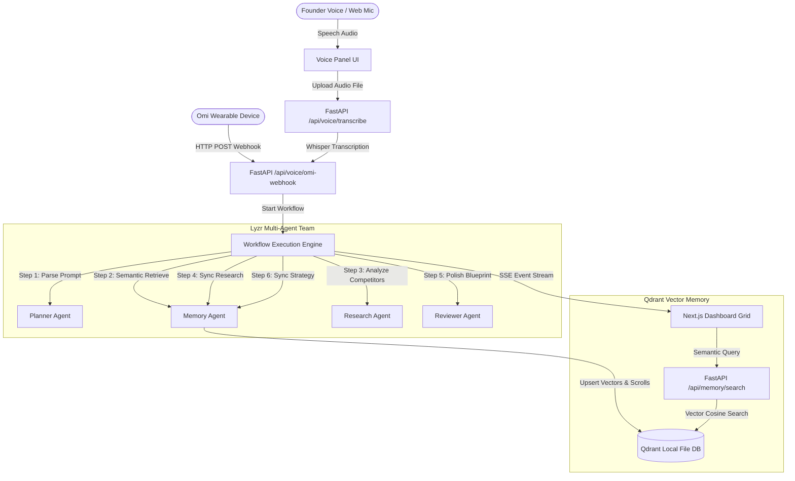

# FounderOS — The AI Startup Operating System

> "Your AI startup team controlled entirely by voice."

FounderOS is a production-grade AI cockpit designed for solo founders. It integrates a voice-first ingestion pipeline, multi-agent orchestration, and a persistent semantic memory database. Powered by **Omi**, **Qdrant**, and **Lyzr**, it coordinates a collaborative team of specialized AI employees to transform thoughts into launchable startup blueprints.

---

## 🛠️ Mandatory Stack Integration

1. **Omi (Voice Layer)**: Handles speech capture and transcriptions. Features a simulated physical webhook receiver (`/api/voice/omi-webhook`) that handles background transcription pushes from Omi wearable devices.
2. **Qdrant (Memory Layer)**: Runs a local, file-persisted, vector memory database (under `./backend/qdrant_db`) supporting cosine distance matching across collections: `conversations`, `startup_ideas`, `reports`, `market_research`, `strategies`, and `workflows`.
3. **Lyzr (Orchestration Layer)**: Runs a sequential multi-agent orchestration pipeline. Specialized agents (**Planner**, **Researcher**, **Memory Agent**, and **Reviewer**) communicate via queued background processes.

---

## 📐 Architecture Diagram



---

## 📂 Project Structure

```text
/
├── backend/                  # FastAPI Backend
│   ├── agents/               # Lyzr Agent Configurations
│   │   ├── base.py           # Base model interfaces (OpenAI, Gemini, Mocks)
│   │   ├── planner.py        # Planner Agent
│   │   ├── researcher.py     # Research Agent
│   │   ├── memory_agent.py   # Memory Agent (Qdrant Sync Hooks)
│   │   └── reviewer.py       # Reviewer Agent
│   ├── workflows/            # Workflow Orchestration
│   │   └── engine.py         # Sequential engine yielding SSE events
│   ├── router/               # API Routes
│   │   ├── voice.py          # Transcribe & Omi Webhook
│   │   ├── workflow.py       # Execution triggering & SSE streams
│   │   └── memory.py         # Semantic search & Timeline scroll
│   ├── main.py               # FastAPI server entrypoint
│   ├── config.py             # Config loader
│   ├── database.py           # Qdrant client connection & embeddings
│   ├── requirements.txt      # Python dependencies
│   └── qdrant_db/            # Local Qdrant persistent storage folders
├── frontend/                 # Next.js 15 App Router Frontend
│   ├── app/                  # Application Router (Layout & Pages)
│   ├── components/           # Glassmorphic Dashboard Widgets
│   │   ├── voice-panel.tsx   # Audio waves & Omi simulator
│   │   ├── workflow-graph.tsx# Custom SVG orchestration flow
│   │   ├── agent-feed.tsx    # Scrollable terminal logs
│   │   ├── task-board.tsx    # Checklist execution board
│   │   ├── memory-timeline.tsx # Chronological database scrolls
│   │   ├── semantic-search.tsx # Similarity query pallet
│   │   └── insights-viewer.tsx # Document Preview / Markdown tabs
│   ├── lib/                  # Client API connections
│   │   └── api.ts            // Fetch & EventSource configurations
│   ├── tailwind.config.ts    # Styling settings
│   └── package.json          # Node dependencies
├── .env.example              # Environment variables template
└── README.md                 # Project handbook
```

---

## 🚀 Setup & Installation (Windows)

### 1. Prerequisites
- **Python 3.12+**
- **Node.js 24+** and **npm**

### 2. Backend Setup
1. Open PowerShell and navigate to the `backend/` folder:
   ```powershell
   cd backend
   ```
2. Create and activate a Python virtual environment:
   ```powershell
   py -m venv venv
   .\venv\Scripts\activate.ps1
   ```
3. Install the dependencies (bypassing Lyzr's metadata limits using ignore flags):
   ```powershell
   pip install -r requirements.txt --ignore-requires-python
   ```
4. Copy the environment template to the root and fill in your keys:
   ```powershell
   cp ../.env.example ../.env
   ```
5. Start the FastAPI server:
   ```powershell
   python main.py
   ```
   The backend will start on [http://127.0.0.1:8000](http://127.0.0.1:8000) and initialize all Qdrant collections.

### 3. Frontend Setup
1. Open a new terminal and navigate to the `frontend/` folder:
   ```powershell
   cd frontend
   ```
2. Install the Node packages:
   ```powershell
   npm install
   ```
3. Start the Next.js development server:
   ```powershell
   npm run dev
   ```
   Open [http://localhost:3000](http://localhost:3000) in your browser.

---

## 🎭 Live Demo Script

Follow this sequence for a high-impact hackathon presentation:

### Scene 1: The AI Operating System Visual Cockpit
1. Show the dashboard on the screen. Highlight the futuristic dark aesthetics, the grid structure, and the **Omi Webhook Status: Active** indicator.
2. Note that the system connects to a local, persistent instance of **Qdrant**, meaning all startup decisions are saved semantically.

### Scene 2: The Voice Intake
1. Option A (Microphone): Click **Record Commands** in the Voice panel, say: *"Create a launch strategy for an AI study app"* and click **Stop**.
2. Option B (Omi simulator): Select the **Create a launch strategy for an AI study app** preset in the Omi Simulator panel and click **Simulate Omi Device Push**.
3. Point out that the Omi webhook immediately accepts the payload, indexes it in `conversations`, and triggers the Lyzr Agent pipeline.

### Scene 3: Multi-Agent Collaboration
1. Point to the **Workflow Orchestration Graph**: The *Planner Node* glows, showing task decomposition. The *Task Execution Board* instantly populates with 4 tasks.
2. Watch the **Live Agent Console Feed** stream logs:
   - The *Planner* splits up the work.
   - The *Memory Agent* checks Qdrant for similar note-taking/study concepts.
   - The *Researcher* performs competitor profiling (Quizlet vs Anki).
   - The *Reviewer* takes the raw data and synthesizes an executive launch strategy.
3. The connecting vector lines in the graph animate to show data flow. Tasks in the task board change states automatically as logs scroll.

### Scene 4: The Confetti & The Asset
1. Once the Reviewer completes the document, a **Confetti Explosion** triggers on screen.
2. The **Executive Assets** panel at the bottom automatically expands with a formatted markdown document.
3. Show the **Preview Tab** displaying tables, Weeks 1-4 technical roadmaps, and target pricing models. Click the **Markdown Tab** and copy the raw file to show product-ready outputs.

### Scene 5: Semantic Retrieval
1. Point to the **Qdrant Memory Timeline** on the right side. It now shows the new documents indexed under `market_research`, `strategies`, and `reports`.
2. Expand a timeline node to show persistent index metadata.
3. Type *"how to beat Quizlet"* in the **Global Semantic Search** bar and click Query.
4. Point out that Qdrant retrieves the relevant section with a precision percentage (e.g. *Relevance: 92%*). Clicking the result immediately opens the original report, completing the semantic loop!

---

## ☁️ Deployment Guide

### Backend Deployment (FastAPI)
1. **Dockerize the Backend**: Create a Dockerfile pointing to `main.py` exposing port `8000`.
2. **Persistent Volumes**: Mount a persistent volume to `/backend/qdrant_db` so your startup memories are not lost on container restarts.
3. **Cloud Run / AWS App Runner**: Deploy the container directly and pass env secrets (`OPENAI_API_KEY`, etc.).

### Frontend Deployment (Next.js)
1. Set the env URL: Ensure `BACKEND_URL` in `lib/api.ts` points to your public cloud endpoint.
2. Deploy to **Vercel** or **Netlify** with a single click from your GitHub repository.
